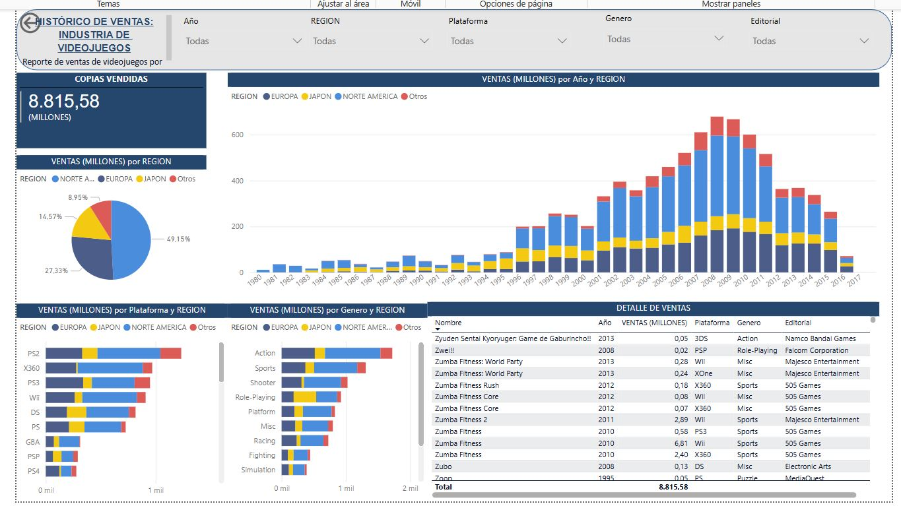

# powerbi-video-game-sales-dashboard
Dashboard interactivo de ventas globales de videojuegos en Power BI
🎮 Dashboard de Análisis de Ventas Globales de Videojuegos – Power BI

## 📊 Descripción
Este proyecto presenta un dashboard interactivo desarrollado en Power BI para analizar las ventas globales de videojuegos.
El objetivo es explorar cómo se distribuyen las ventas a lo largo de los años, en diferentes plataformas, géneros y regiones del mundo.
## 🔎 Características del Dashboard
- Ventas por continente a lo largo del tiempo
- Porcentaje de ventas por región
- Ventas por plataforma
- Ventas por género
- Ventas globales totales

## 🎛️ Filtros interactivos
El dashboard permite filtrar la información por:
- Año
- Región
- Plataforma
- Género
- Editorial
## 🛠 Herramientas utilizadas
- Power BI
- Data Visualization
- Data Analysis
## 📷 Vista del Dashboard

## 🔗 Dashboard interactivo
Puedes acceder al dashboard aquí:
https://lnkd.in/dwygayuY
